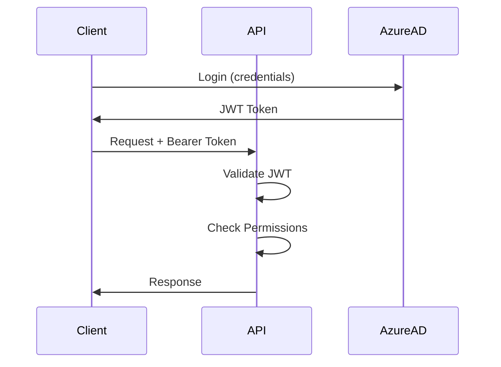

# Authentication & Authorization Guide

## Overview

EVA RAG implements Azure AD-based authentication with JWT tokens and role-based access control (RBAC).

## Authentication Flow



## Setup

### 1. Azure AD App Registration

```bash
# Create Azure AD app registration
az ad app create \
  --display-name "EVA RAG API" \
  --sign-in-audience AzureADMyOrg

# Get app details
az ad app list --display-name "EVA RAG API" --query "[0].{appId:appId,objectId:id}"

# Create service principal
az ad sp create --id <APP_ID>

# Add API permissions (optional)
az ad app permission add \
  --id <APP_ID> \
  --api 00000003-0000-0000-c000-000000000000 \
  --api-permissions e1fe6dd8-ba31-4d61-89e7-88639da4683d=Scope
```

### 2. Environment Configuration

```bash
# .env
AUTH_ENABLED=true
AZURE_AD_TENANT_ID=<your-tenant-id>
AZURE_AD_CLIENT_ID=<your-client-id>
JWT_ALGORITHM=RS256
JWT_AUDIENCE=eva-rag-api

# Development mode (skip auth)
AUTH_ENABLED=false
```

### 3. Install Dependencies

```bash
poetry add python-jose[cryptography] python-multipart
```

## User Roles

| Role     | Permissions                                      |
|----------|--------------------------------------------------|
| `admin`  | Full access (all tenants, all spaces)            |
| `user`   | Read/write within assigned spaces                |
| `viewer` | Read-only access to assigned spaces              |
| `system` | Service account (internal operations)            |

## API Protection

### Require Authentication

```python
from fastapi import Depends
from eva_rag.auth import require_authenticated, UserIdentity

@app.get("/protected")
async def protected_endpoint(
    user: UserIdentity = Depends(require_authenticated)
):
    return {"message": f"Hello {user.email}"}
```

### Require Specific Role

```python
from eva_rag.auth import require_admin, UserIdentity

@app.delete("/admin/purge")
async def admin_only(
    user: UserIdentity = Depends(require_admin)
):
    return {"message": "Admin action completed"}
```

### Require Space Access

```python
from eva_rag.auth import require_space_access, UserIdentity

@app.get("/spaces/{space_id}/documents")
async def get_documents(
    space_id: str,
    user: UserIdentity = Depends(require_space_access(space_id))
):
    # User has verified access to this space
    return {"space_id": space_id, "documents": [...]}
```

### Require Tenant Match

```python
from eva_rag.auth import require_tenant_match, UserIdentity

@app.get("/tenants/{tenant_id}/stats")
async def get_tenant_stats(
    tenant_id: str,
    user: UserIdentity = Depends(require_tenant_match(tenant_id))
):
    # User's tenant_id matches the requested tenant
    return {"tenant_id": tenant_id, "stats": {...}}
```

### Require Resource Ownership

```python
from eva_rag.auth import require_owner_or_admin, UserIdentity

@app.delete("/documents/{doc_id}")
async def delete_document(
    doc_id: str,
    user: UserIdentity = Depends(require_authenticated)
):
    # Fetch document
    doc = get_document(doc_id)
    
    # Check ownership
    if user.user_id != doc.user_id and UserRole.ADMIN not in user.roles:
        raise HTTPException(status_code=403, detail="Not authorized")
    
    # Delete
    delete_document(doc_id)
    return {"status": "deleted"}
```

## Client Usage

### Obtain JWT Token (Azure AD)

```bash
# Using Azure CLI
TOKEN=$(az account get-access-token --resource <CLIENT_ID> --query accessToken -o tsv)

# Using curl (password flow - dev only)
curl -X POST https://login.microsoftonline.com/<TENANT_ID>/oauth2/v2.0/token \
  -d "client_id=<CLIENT_ID>" \
  -d "scope=<CLIENT_ID>/.default" \
  -d "username=user@domain.com" \
  -d "password=<PASSWORD>" \
  -d "grant_type=password"
```

### Make Authenticated Request

```bash
# Using curl
curl -H "Authorization: Bearer $TOKEN" \
  https://api.eva-rag.com/spaces/123/documents

# Using Python
import requests

headers = {"Authorization": f"Bearer {token}"}
response = requests.get("https://api.eva-rag.com/spaces/123/documents", headers=headers)
```

### Development Mode (No Auth)

```python
# When AUTH_ENABLED=false, all requests use mock user
response = requests.get("https://api.eva-rag.com/spaces/123/documents")
# Works without token!
```

## Space Access Control

### Assign User to Spaces

```python
# JWT token should include "spaces" claim
{
  "sub": "user-123",
  "email": "user@example.com",
  "roles": ["user"],
  "spaces": ["space-abc", "space-xyz"]
}
```

### Check Space Access in Code

```python
from eva_rag.auth import get_current_user, UserRole

async def verify_space_access(space_id: str, user: UserIdentity):
    # Admin has access to all spaces
    if UserRole.ADMIN in user.roles:
        return True
    
    # Check explicit space membership
    if space_id in user.spaces:
        return True
    
    # Check wildcard (dev mode)
    if "*" in user.spaces:
        return True
    
    return False
```

## Error Handling

### Authentication Errors

```json
// 401 Unauthorized
{
  "detail": "Invalid authentication credentials: Token expired"
}
```

### Authorization Errors

```json
// 403 Forbidden
{
  "detail": {
    "message": "Insufficient permissions",
    "error_type": "AuthorizationError",
    "required_role": "admin"
  }
}
```

## Testing

### Unit Tests with Mock User

```python
from unittest.mock import AsyncMock
from eva_rag.auth import UserIdentity, UserRole

def test_protected_endpoint():
    # Mock authenticated user
    mock_user = UserIdentity(
        user_id="test-123",
        email="test@example.com",
        roles=[UserRole.USER],
        tenant_id="tenant-123",
        spaces=["space-abc"]
    )
    
    # Test endpoint
    response = client.get(
        "/spaces/space-abc/documents",
        headers={"Authorization": "Bearer fake-token"}
    )
    
    assert response.status_code == 200
```

### Integration Tests with Real Token

```python
import pytest
from azure.identity import DefaultAzureCredential

@pytest.fixture
def auth_token():
    credential = DefaultAzureCredential()
    token = credential.get_token("<CLIENT_ID>/.default")
    return token.token

def test_with_real_auth(auth_token):
    response = client.get(
        "/spaces/space-abc/documents",
        headers={"Authorization": f"Bearer {auth_token}"}
    )
    assert response.status_code in [200, 403]  # 403 if not authorized
```

## Security Best Practices

1. **Always use HTTPS** - Never send tokens over HTTP
2. **Token expiration** - Set short expiration times (1-2 hours)
3. **Refresh tokens** - Implement token refresh flow
4. **Validate issuer** - Check JWT issuer matches Azure AD tenant
5. **Audit access** - Log all authentication/authorization events
6. **Principle of least privilege** - Grant minimum required permissions
7. **Rotate secrets** - Rotate JWT signing keys regularly
8. **Rate limiting** - Implement per-user rate limits

## Troubleshooting

### "Invalid authentication credentials"

- Check token format: `Bearer <token>`
- Verify token not expired: Decode at jwt.io
- Ensure `JWT_SECRET` matches

### "Access denied to space"

- Verify user has space in `spaces` claim
- Check user role (admin bypasses check)
- Ensure space ID matches exactly

### "Token expired"

- Implement token refresh flow
- Increase token expiration time (not recommended)
- Re-authenticate user

### Development Mode Not Working

- Set `AUTH_ENABLED=false` in .env
- Restart API server
- Verify environment variable loaded

## Next Steps

1. ✅ Configure Azure AD app registration
2. ✅ Set environment variables
3. ✅ Protect API endpoints with decorators
4. ⏭️ Implement token refresh flow
5. ⏭️ Add role management UI
6. ⏭️ Set up audit logging

## References

- [Azure AD Authentication](https://docs.microsoft.com/azure/active-directory/develop/)
- [JWT.io](https://jwt.io) - JWT debugger
- [FastAPI Security](https://fastapi.tiangolo.com/tutorial/security/)
